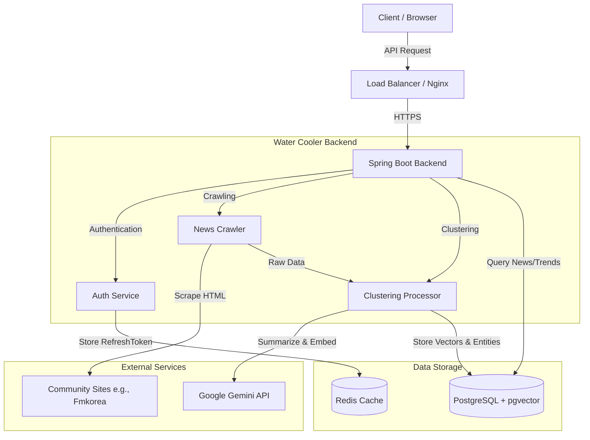
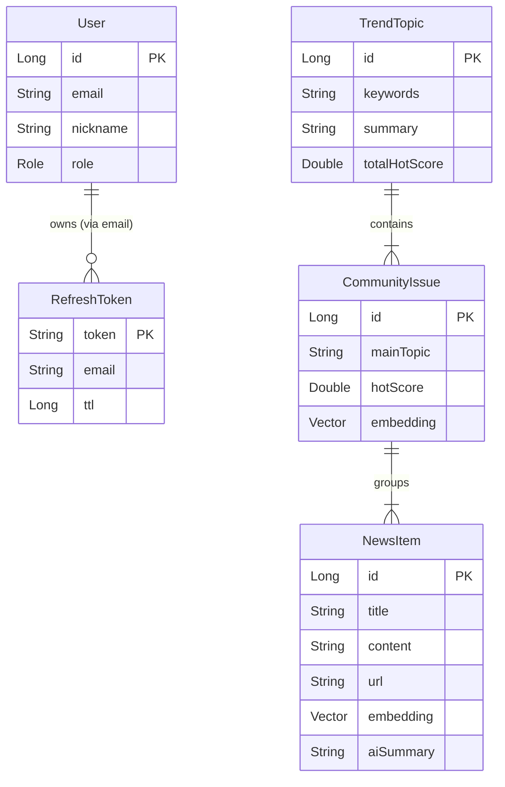
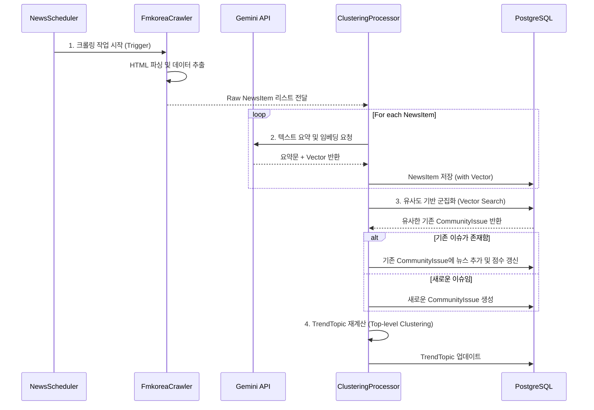

# Water Cooler

**Water Cooler**는 다양한 글로벌 커뮤니티의 이슈를 수집하고, **Google Gemini AI**를 활용해 핵심 내용으로 요약, 이를 클러스터링을 통해 커뮤니티의 이슈로 등록, 이 중 트렌디한 컨텐츠는 `TrendTopic`으로 내세워 각 커뮤니티의 이슈들을 사용자에게 전달하는 것이 목표입니다.

사람들이 정수기(Water Cooler) 앞에서 가볍게 이야기를 나누듯, 세상의 핫한 이슈를 쉽고 빠르게 파악할 수 있도록 돕습니다.

## Tech Stack

### Backend

- **Language**: Kotlin (JDK 21)
- **Framework**: Spring Boot 4.0.1
- **Database**: PostgreSQL 18.1
- **Cache**: Redis 8.4
- **Security**: Spring Security, JWT (jjwt 0.13.0)
- **Crawling**: Jsoup 1.22.1
- **AI**: Google GenAI SDK 1.32.0 (Gemini)

### Infrastructure

- **Docker & Docker Compose**

## System Design

프로젝트의 전체 구조와 데이터 흐름을 시각화한 다이어그램입니다.

### 1. System Architecture
Spring Boot 서버를 중심으로 데이터 수집(Crawler), 분석(AI), 저장(DB)의 흐름을 보여줍니다. Redis는 인증 처리를, PostgreSQL(pgvector)은 벡터 검색과 영속성을 담당합니다.

### 2. Entity Relationship Diagram (ERD)
`NewsItem` -> `CommunityIssue` -> `TrendTopic`으로 이어지는 계층형 데이터 구조입니다.

### 3. Core Logic Sequence (Crawling & Clustering)
크롤링부터 AI 분석, 벡터 유사도 기반 클러스터링까지의 비동기 처리 과정입니다.

## Clustering

기존의 통계적 자연어 처리가 아닌, LLM 기반을 고려했습니다.

단순히 최신 기술을 도입하는 것이 목적이 아닌, 비정형적이고 은어와 변형이 난무하는 커뮤니티 데이터를 정확하게 파악하기 위해서는 키워드 매칭이 아닌 맥락과 의미를 이해할 수 있어야하기 때문입니다.

### Naver News의 방식과 본 프로젝트의 차이

[네이버 뉴스 AI 알고리즘 안내](https://media.naver.com/algorithm#_cluster)

| 구분            | Naver                        | Water Cooler              |
| :-------------- | :--------------------------- | :------------------------ |
| **핵심 기술**   | **통계적 빈도** (TF-IDF)     | **의미론적 임베딩**       |
| **데이터 처리** | 형태소 분석 (단어 원형 복원) | **맥락 기반 토큰화**      |
| **매칭 논리**   | 키워드 중복                  | **의미 유사도**           |
| **한계점**      | 단어 불일치 시 매칭 실패     | **은어, 비유, 맥락 이해** |

### Keyword Based의 한계

- 커뮤니티에서는 "삼성전자"를 "삼전", "킹성" 등으로 다양하게 부릅니다.
- 형태소 분석과 같은 방식에서는 신조어와 변형을 실시간으로 따라잡을 수 없습니다.
- 맥락이 없다면, "애플이 망했다"와 "사과가 썩었다"를 키워드 기반으로는 구별하거나 연결하기 어렵습니다.

### 의미 기반의 필연성

- 단어의 형태가 달라도 의미가 같다면 동일한 이슈로 볼 수있습니다.
- 별도의 사전 업데이트 없이도 밈이나 유행어를 하나의 이슈로 그룹화할 수 있습니다.

## Performance Optimization (Dev Log)

### Google GenAI 입력 토큰 최적화

Google Gen Ai 이용한 News 요약 기능 구현 중, 다수의 이미지가 포함된 게시글 처리 시 Input Token의 과다 사용 문제가 발생함.

- **기존 방식**: 본문의 이미지를 다운로드 후, 멀티모달 프롬프트로 직접 업로드.
- **변경 방식**: 이미지를 업로드하지 않고, 본문에 `이미지 경로`만 텍스트 형태로 남겨 처리.
- **결과** : 입력 토큰 수가 획기적으로 줄어듦, 뉴스 요약의 본질을 해치지 않으면서 같은 퀄리티로 비용 효율성 확보.

